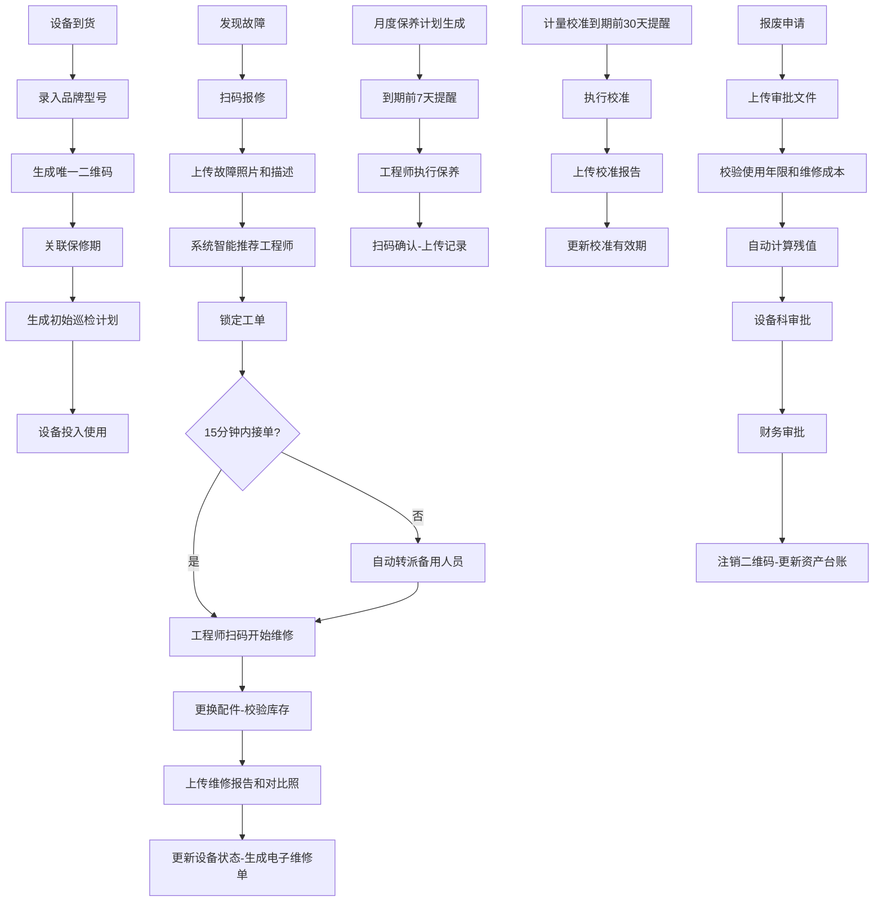

## 1. 产品概述

本系统为大型综合医院医疗设备全生命周期管理平台，实现从设备采购入库、日常使用、维护保养、计量校准到报废处置的全流程数字化管理。系统支持设备科主任、维修工程师、使用科室护士长、财务人员和院长五种角色协同工作，通过二维码技术、智能派单、自动提醒和数据分析，提升设备管理效率，降低运营成本，保障医疗安全。

## 2. 核心功能

### 2.1 用户角色

| 角色 | 注册方式 | 核心权限 |
|------|----------|----------|
| 设备科主任 | 管理员创建 | 设备入库审批、工单管理、库存管理、报废审批、数据报表 |
| 维修工程师 | 管理员创建 | 接单维修、保养执行、校准执行、配件申领、维修报告上传 |
| 使用科室护士长 | 管理员创建 | 设备报修、保养确认、报废申请、科室设备查询 |
| 财务人员 | 管理员创建 | 维修成本核算、残值计算、资产台账管理、财务审批 |
| 院长 | 管理员创建 | 全院数据看板、设备利用率分析、月度报告、决策支持 |

### 2.2 功能模块

1. **设备入库管理**: 设备信息录入、二维码生成、保修期关联、巡检计划生成
2. **故障报修管理**: 扫码报修、故障描述上传、智能派单、工单锁定、自动转派
3. **维修执行管理**: 扫码维修、配件库存校验、耗材记录、维修报告上传
4. **保养计划管理**: 月度保养自动生成、到期提醒、保养确认、记录上传
5. **计量校准管理**: 校准提醒、报告上传、有效期更新、超期设备锁定
6. **报废审批管理**: 报废申请、使用年限校验、残值计算、多级审批、资产注销
7. **数据分析报表**: 设备利用率、故障率、维修成本雷达图、月度运行报告
8. **消息通知中心**: 实时消息推送、待办提醒、凭证下载

### 2.3 页面详情

| 页面名称 | 模块名称 | 功能描述 |
|----------|----------|----------|
| 登录页 | 身份认证 | 账号密码登录、角色选择、记住密码 |
| 首页仪表盘 | 数据概览 | 设备总数、在线率、待处理工单、本月保养计划、消息提醒 |
| 设备档案管理 | 设备列表 | 设备信息查询、筛选、详情查看、二维码打印 |
| 设备档案管理 | 设备入库 | 品牌型号录入、二维码生成、保修期设置、巡检计划配置 |
| 工单管理 | 报修列表 | 故障工单查询、状态跟踪、派单操作 |
| 工单管理 | 工单详情 | 故障信息、维修进度、配件使用、报告查看 |
| 维修工作台 | 待接工单 | 待处理工单列表、一键接单、开始维修 |
| 维修工作台 | 维修执行 | 扫码确认、配件领用、维修报告上传、完工确认 |
| 保养管理 | 保养计划 | 月度计划列表、到期提醒、保养确认 |
| 计量管理 | 校准计划 | 校准设备列表、到期提醒、报告上传 |
| 报废管理 | 报废申请 | 设备报废申请、审批文件上传、残值计算 |
| 报废管理 | 审批流程 | 设备科审批、财务审批、注销二维码 |
| 数据报表 | 综合看板 | 各科室设备利用率、故障率、维修成本雷达图 |
| 数据报表 | 月度报告 | 全院设备运行报告、停机时长、维修次数、保养完成率 |
| 消息中心 | 通知列表 | 实时消息、待办提醒、历史记录、凭证下载 |
| 系统管理 | 用户管理 | 用户账号、角色权限、密码重置 |
| 系统管理 | 基础配置 | 设备类型、故障代码、配件库、巡检周期配置 |

## 3. 核心流程

### 3.1 设备入库流程
新设备到货后，设备科主任录入品牌型号等信息，系统自动生成唯一二维码标签，关联保修期信息，并根据设备类型生成初始巡检计划。

### 3.2 故障报修流程
使用科室发现故障后扫码报修，上传故障照片和描述，系统根据故障代码和历史维修记录自动推荐匹配的工程师并锁定工单。若15分钟内未接单，系统自动转派备用人员。工程师接单后扫码开始维修，更换配件时系统自动校验库存并记录耗材编码，完工后上传维修报告和对比照片。

### 3.3 保养执行流程
系统根据设备运行时长和维护周期自动生成月度保养计划，到期前7天推送提醒给负责工程师。工程师完成保养后扫码确认并上传保养记录。

### 3.4 计量校准流程
计量器具到期前30天系统自动推送校准提醒，校准完成后上传校准报告，系统自动更新校准有效期。超期设备自动锁定禁止使用。

### 3.5 报废审批流程
使用科室提交报废申请并上传审批文件，系统校验设备使用年限和维修成本后自动计算残值，推送设备科和财务审批。审批通过后注销二维码并更新资产台账。

## 4. 用户界面设计

### 4.1 设计风格
- **主色调**: 医疗蓝 (#1890FF)，代表专业、信任、科技
- **辅助色**: 绿色 (#52C41A) 表示正常运行，橙色 (#FA8C16) 表示待处理，红色 (#F5222D) 表示故障/报警
- **按钮风格**: 圆角矩形，带有微妙的阴影效果，hover时有轻微上浮动画
- **字体**: 主标题使用 "Noto Sans SC" Bold，正文使用 "Noto Sans SC" Regular
- **布局风格**: 左侧导航栏 + 顶部工具栏 + 内容区卡片式布局
- **图标风格**: 使用Ant Design图标，保持简洁统一

### 4.2 页面设计概述

| 页面名称 | 模块名称 | UI元素 |
|----------|----------|--------|
| 登录页 | 身份认证 | 渐变背景、玻璃态登录卡片、角色选择下拉框、动画效果 |
| 首页仪表盘 | 数据概览 | 数据卡片组、统计图表、待办事项列表、最近活动时间线 |
| 设备列表 | 设备档案 | 搜索筛选栏、表格视图、二维码预览弹窗、状态标签 |
| 工单详情 | 工单管理 | 步骤进度条、信息卡片组、照片轮播、操作按钮组 |
| 维修工作台 | 维修执行 | 工单卡片、计时器、配件选择器、图片上传区 |
| 数据报表 | 综合看板 | 雷达图、柱状图、折线图、热力图、科室对比卡片 |
| 消息中心 | 通知列表 | 分类标签、消息卡片、未读标记、批量操作 |

### 4.3 响应式设计
- 采用桌面端优先设计，适配1366px及以上分辨率
- 平板端：侧边栏可收起，表格支持横向滚动
- 手机端：简化布局，底部导航栏，卡片式列表展示核心功能
- 所有图表支持自适应容器大小

### 4.4 交互动效
- 页面加载时采用渐入动画，元素依次出现
- 数据卡片hover时有轻微上浮和阴影加深效果
- 状态变更时采用平滑过渡动画
- 通知消息采用从右侧滑入的动效
- 二维码生成时带有扫描线动画效果
