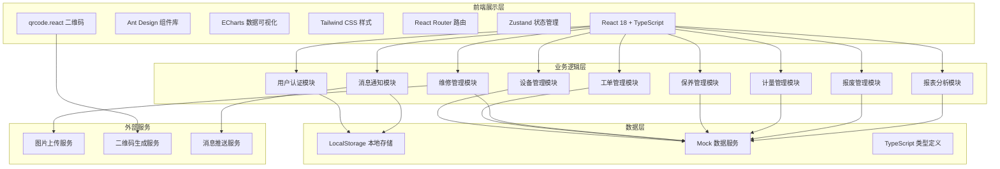
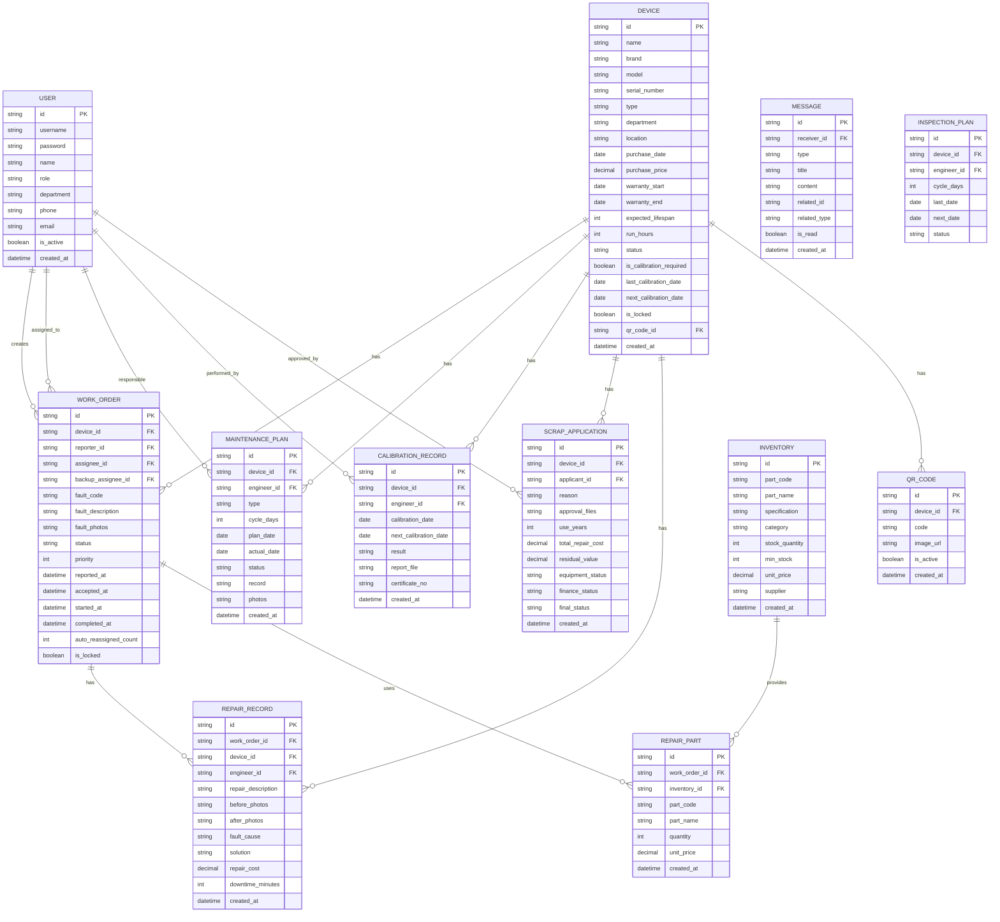

## 1. 架构设计



## 2. 技术描述

- **前端框架**: React@18 + TypeScript@5
- **构建工具**: Vite@5
- **UI组件库**: Ant Design@5
- **样式方案**: Tailwind CSS@3
- **路由管理**: React Router@6
- **状态管理**: Zustand@4
- **图表库**: ECharts@5
- **二维码**: qrcode.react@3
- **图标库**: @ant-design/icons@5
- **数据层**: Mock数据 + LocalStorage持久化
- **HTTP客户端**: Axios@1（预留接口）

## 3. 路由定义

| 路由路径 | 页面名称 | 访问角色 | 说明 |
|----------|----------|----------|------|
| /login | 登录页 | 所有 | 身份认证入口 |
| /dashboard | 首页仪表盘 | 所有 | 根据角色展示不同数据 |
| /devices | 设备列表 | 所有 | 设备档案查询 |
| /devices/new | 设备入库 | 设备科主任 | 新设备录入 |
| /devices/:id | 设备详情 | 所有 | 设备详细信息 |
| /workorders | 工单列表 | 所有 | 故障工单查询 |
| /workorders/:id | 工单详情 | 所有 | 工单进度跟踪 |
| /repair | 维修工作台 | 维修工程师 | 待接工单和维修执行 |
| /maintenance | 保养计划 | 维修工程师、护士长 | 月度保养计划管理 |
| /calibration | 计量校准 | 维修工程师、设备科主任 | 校准计划管理 |
| /scrap | 报废管理 | 护士长、设备科主任、财务 | 报废申请和审批 |
| /reports | 数据报表 | 院长、设备科主任、财务 | 综合看板和月度报告 |
| /messages | 消息中心 | 所有 | 通知消息管理 |
| /system/users | 用户管理 | 设备科主任 | 用户账号和权限 |
| /system/config | 基础配置 | 设备科主任 | 系统参数配置 |

## 4. 数据模型

### 4.1 ER图



### 4.2 TypeScript 类型定义

```typescript
// 用户角色
type UserRole = 'director' | 'engineer' | 'nurse' | 'finance' | 'admin';

// 用户
interface User {
  id: string;
  username: string;
  name: string;
  role: UserRole;
  department: string;
  phone: string;
  email: string;
  avatar?: string;
}

// 设备状态
type DeviceStatus = 'normal' | 'fault' | 'maintenance' | 'calibration' | 'scrapped' | 'locked';

// 设备类型
interface Device {
  id: string;
  name: string;
  brand: string;
  model: string;
  serialNumber: string;
  type: string;
  department: string;
  location: string;
  purchaseDate: string;
  purchasePrice: number;
  warrantyStart: string;
  warrantyEnd: string;
  expectedLifespan: number;
  runHours: number;
  status: DeviceStatus;
  isCalibrationRequired: boolean;
  lastCalibrationDate?: string;
  nextCalibrationDate?: string;
  isLocked: boolean;
  qrCodeId: string;
  createdAt: string;
}

// 二维码
interface QRCode {
  id: string;
  deviceId: string;
  code: string;
  imageUrl: string;
  isActive: boolean;
}

// 工单状态
type WorkOrderStatus = 'pending' | 'assigned' | 'accepted' | 'in_progress' | 'completed' | 'cancelled' | 'reassigned';

// 工单
interface WorkOrder {
  id: string;
  deviceId: string;
  reporterId: string;
  assigneeId?: string;
  backupAssigneeId?: string;
  faultCode: string;
  faultDescription: string;
  faultPhotos: string[];
  status: WorkOrderStatus;
  priority: 1 | 2 | 3;
  reportedAt: string;
  acceptedAt?: string;
  startedAt?: string;
  completedAt?: string;
  autoReassignedCount: number;
  isLocked: boolean;
}

// 维修记录
interface RepairRecord {
  id: string;
  workOrderId: string;
  deviceId: string;
  engineerId: string;
  repairDescription: string;
  beforePhotos: string[];
  afterPhotos: string[];
  faultCause: string;
  solution: string;
  repairCost: number;
  downtimeMinutes: number;
  createdAt: string;
}

// 维修配件
interface RepairPart {
  id: string;
  workOrderId: string;
  inventoryId: string;
  partCode: string;
  partName: string;
  quantity: number;
  unitPrice: number;
}

// 库存配件
interface Inventory {
  id: string;
  partCode: string;
  partName: string;
  specification: string;
  category: string;
  stockQuantity: number;
  minStock: number;
  unitPrice: number;
  supplier: string;
}

// 保养计划
interface MaintenancePlan {
  id: string;
  deviceId: string;
  engineerId: string;
  type: 'monthly' | 'quarterly' | 'yearly';
  cycleDays: number;
  planDate: string;
  actualDate?: string;
  status: 'pending' | 'in_progress' | 'completed' | 'overdue';
  record?: string;
  photos?: string[];
}

// 校准记录
interface CalibrationRecord {
  id: string;
  deviceId: string;
  engineerId: string;
  calibrationDate: string;
  nextCalibrationDate: string;
  result: 'pass' | 'fail' | 'conditional';
  reportFile: string;
  certificateNo: string;
}

// 报废申请
interface ScrapApplication {
  id: string;
  deviceId: string;
  applicantId: string;
  reason: string;
  approvalFiles: string[];
  useYears: number;
  totalRepairCost: number;
  residualValue: number;
  equipmentStatus: 'pending' | 'approved' | 'rejected';
  financeStatus: 'pending' | 'approved' | 'rejected';
  finalStatus: 'pending' | 'approved' | 'rejected';
  createdAt: string;
}

// 消息
interface Message {
  id: string;
  receiverId: string;
  type: 'workorder' | 'maintenance' | 'calibration' | 'scrap' | 'system';
  title: string;
  content: string;
  relatedId?: string;
  relatedType?: string;
  isRead: boolean;
  createdAt: string;
}

// 巡检计划
interface InspectionPlan {
  id: string;
  deviceId: string;
  engineerId: string;
  cycleDays: number;
  lastDate?: string;
  nextDate: string;
  status: 'pending' | 'completed';
}
```

## 5. 目录结构

```
src/
├── assets/              # 静态资源
├── components/          # 公共组件
│   ├── layout/         # 布局组件
│   ├── charts/         # 图表组件
│   ├── qrcode/         # 二维码组件
│   └── common/         # 通用组件
├── pages/              # 页面组件
│   ├── login/
│   ├── dashboard/
│   ├── devices/
│   ├── workorders/
│   ├── repair/
│   ├── maintenance/
│   ├── calibration/
│   ├── scrap/
│   ├── reports/
│   ├── messages/
│   └── system/
├── store/              # 状态管理
│   ├── useAuthStore.ts
│   ├── useDeviceStore.ts
│   ├── useWorkOrderStore.ts
│   └── useMessageStore.ts
├── services/           # 服务层
│   ├── auth.service.ts
│   ├── device.service.ts
│   ├── workorder.service.ts
│   └── mock/           # Mock数据
├── types/              # 类型定义
│   └── index.ts
├── utils/              # 工具函数
│   ├── qrcode.ts
│   ├── date.ts
│   ├── notification.ts
│   └── calculator.ts
├── router/             # 路由配置
│   └── index.tsx
├── App.tsx
├── main.tsx
└── index.css
```
